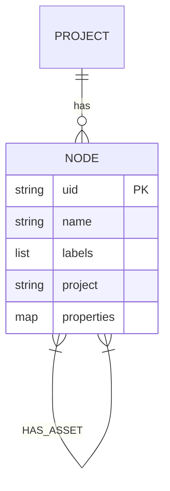

# Architecture: Veracity Engine - Deterministic GraphRAG

## Current State vs. Target State

### Current State (Alpha - Production Readiness: 15%)
The system implements core functionality but lacks production-grade infrastructure:

**Implemented:**
- ✅ Python AST parsing for code entities
- ✅ Incremental sync using SHA1 hashing
- ✅ Basic multitenancy via project labels
- ✅ Vector indexing for Class/Function nodes
- ✅ React visualization UI
- ✅ Docker Compose stack (Neo4j, NeoDash, UI)

**Critical Gaps (Target State):**
- ❌ Only .py and .md files indexed (not all file types)
- ❌ No configuration hierarchy (CLI only)
- ❌ Models and dependencies unpinned (non-deterministic)
- ❌ Hardcoded passwords (security issue)
- ❌ No observability (logs, metrics, health checks)
- ❌ LLM synthesis in default query output (violates evidence-only)
- ❌ No deterministic chunking strategy
- ❌ No provenance tracking
- ❌ No query guards for cross-tenant leakage

## Production-Ready Architecture (16-Layer Reference)
Based on 2025 research, production-grade GraphRAG requires 16 layers. Current implementation covers ~3 layers.

### Layer Status Summary
| Layer | Name | Status | Story |
|-------|------|--------|-------|
| 1 | Configuration Management | ⚠️ Partial | 001 |
| 2 | Ingestion Pipeline | ⚠️ Partial | 007 |
| 3 | Change Detection | ✅ SHA1 | - |
| 4 | File Parsing | ⚠️ Python-only | 007 |
| 5 | Entity Extraction | ❌ AST only | 007 |
| 6 | Chunking Strategy | ❌ None | 008 |
| 7 | Knowledge Graph | ⚠️ Basic | 006 |
| 8 | Vector Search | ❌ Unpinned | 008 |
| 9 | Query Engine | ⚠️ LLM synthesis | 010 |
| 10 | Query Routing | ❌ None | - |
| 11 | Caching | ❌ None | - |
| 12 | Security | ❌ Hardcoded | 003 |
| 13 | Deployment | ❌ No VPS validation | 005 |
| 14 | Observability | ❌ None | 004 |
| 15 | Alerting | ❌ None | - |
| 16 | Analytics | ❌ None | - |

## System Architecture (Current)

### Data Flow (What Exists Today)
```
Source Code → build_graph.py → AST Parser → Neo4j
                                   ↓
                           Ollama Embeddings
                                   ↓
                           Neo4j Vector Index

Query → ask_codebase.py → Hybrid Search → LLM Synthesis → Output
```

### Current Data Model


**Node Types Currently Supported:**
- File (Python only)
- Class (Python)
- Function (Python)
- Document (Markdown)
- Capability (Hierarchy)
- Feature (Hierarchy)
- Component (Hierarchy)

**Missing Node Types:**
- Chunk (for deterministic chunking)
- BinaryFile (metadata-only)
- ConfigInfra (YAML, JSON, Dockerfile, etc.)
- Service (for API definitions)
- Contract (for schemas)

## Taxonomy (Currently Partially Implemented)

### 4-Tier Hierarchy (Exists but Incomplete)
1. **Capability** (Level 1): Project domain (e.g., "services", "core")
2. **Feature** (Level 2): Functional grouping (e.g., "auth", "ui")
3. **Component** (Level 3): logical unit (e.g., "oauth", "components")
4. **Asset** (Level 4): Physical file

**Status**: Hierarchy exists but only Python assets linked. Asset Categories not fully enforced.

### Asset Categories (Defined but Not Enforced)
- **Code**: [.py, .js, .jsx, .ts, .tsx, .go, .java]
- **Infrastructure**: [Dockerfile, docker-compose.yml, Makefile, .tf]
- **Documentation**: [.md, .txt, .rst]
- **Config**: [.json, .yaml, .toml, .xml]

**Status**: Classifier exists but not used for indexing beyond initial categorization.

## Deployment Architecture (Target)

### VPS Deployment
```
┌─────────────────────────────────────────┐
│ VPS (Hostinger or Similar)              │
│                                         │
│  ┌───────────────────────────────────┐  │
│  │ Docker Compose Stack              │  │
│  │                                  │  │
│  │  ┌────────────┐  ┌────────────┐   │  │
│  │  │ Neo4j      │  │   Ollama    │   │  │
│  │  │ 5.15.0      │  │   (local)   │   │  │
│  │  └────────────┘  └────────────┘   │  │
│  │                                  │  │
│  │  ┌────────────┐                  │  │
│  │  │ NeoDash    │                  │  │
│  │  └────────────┘                  │  │
│  │                                  │  │
│  │  ┌────────────┐                  │  │
│  │  │ Veracity UI │                  │  │
│  │  │ (React+Vite)│                  │  │
│  │  └────────────┘                  │  │
│  └───────────────────────────────────┘  │
│                                         │
│  Health Checks (7474, 7687, 5173)       │
│  Metrics Endpoint (8080)               │
└─────────────────────────────────────────┘

Observability:
- JSON Logs → /var/log/veracity/
- Health Checks → HTTP /health, /ready
- Metrics → Prometheus format /metrics
```

## Determinism Requirements (Target)

### Current Issues
1. **Embeddings**: No model version pinning
2. **Chunking**: No chunking, random indexing order
3. **Config**: CLI-only, no hierarchical overrides
4. **Tests**: No determinism tests

### Target State
- Models: Pinned to SHA256 digests
- Embeddings: Seeded generation, reproducible vectors
- Chunking: Deterministic boundaries (1200 chars, 200 overlap)
- Config: CLI → Env → Config File → Defaults
- Cache: Content-addressable with SHA256 keys

## Reference Documents

- **PRD**: `docs/PRD_GRAPHRAG.md` (Updated 2025-12-30)
- **Architecture Review**: `docs/research/ARCHITECTURE_REVIEW_DEEP_DIVE.md`
- **16-Layer Architecture**: Referenced in research documents
- **Story Tracker**: `docs/plans/MASTER_TASKS.md`
